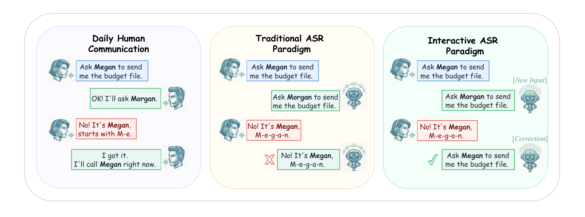
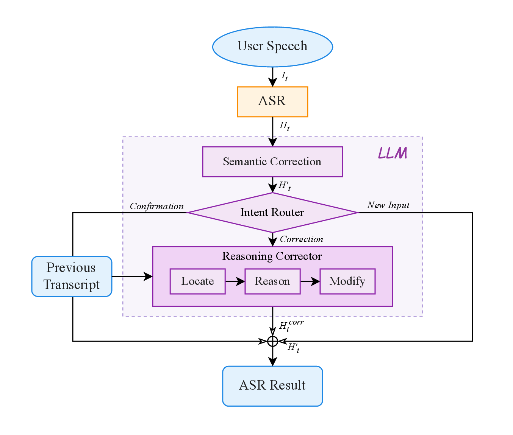
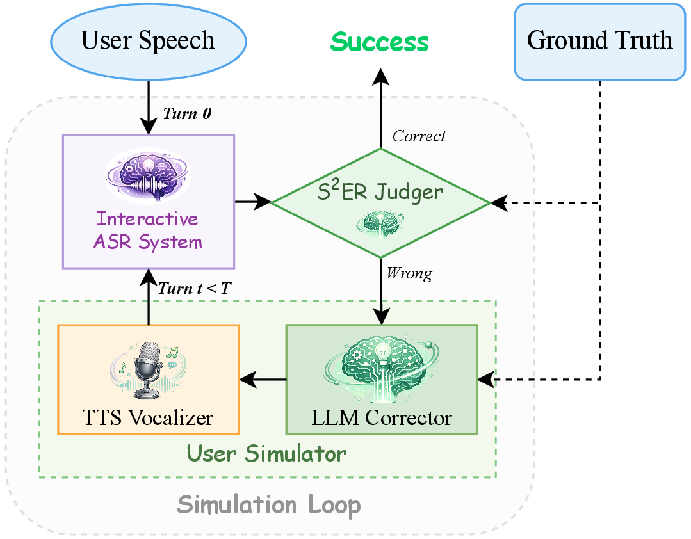

# Interactive ASR

[English README](README.md)

[项目主页](https://interactiveasr.github.io/) | [GitHub](https://github.com/InteractiveASR/AgenticASR) | [论文 1](https://arxiv.org/abs/2604.09121) | [论文 2](https://arxiv.org/abs/2605.29430)

这是 **Interactive ASR** 项目族的官方研究代码仓库，公开部分主要包括：

- **Agentic ASR**：基于多轮纠错的交互式语音识别
- **S²ER**：面向语义正确性的句级评测指标
- **Interactive Simulation Framework**：用于可复现实验的交互仿真框架

## 项目概述

传统 ASR 通常被建模为一次性转写任务，但真实的人机交互并不是这样。当识别结果出错时，用户会通过确认、澄清和纠正来逐步修复系统输出。Interactive ASR 关注的正是这一缺失的交互闭环。

<p align="center">
  
</p>

本仓库整理了 Interactive ASR 两篇论文背后的核心可执行部分：

1. 用户侧纠错代理，生成自然的人类式口头纠错
2. ASR 侧修正代理，根据纠错语音修改当前识别结果
3. 超越 token overlap 的语义评测层
4. 面向 benchmark 的可复现交互仿真框架

## 摘要

我们将 ASR 重新定义为一个多轮 refinement 任务，而不是一次性转写任务。为此，我们提出 **Agentic ASR**，它把基础 ASR 解码、用户式语音纠错和基于推理的文本修正组织成一个闭环系统。我们进一步提出 **S²ER**，用于衡量语义层面的识别错误，因为传统的 CER/WER 往往无法充分反映语义关键错误。同时，我们提供 **Interactive Simulation Framework**，用于大规模、可复现地评测交互式 ASR。整个仓库对应的是这一研究方向的公开 artifact 层。

## 组成部分

本仓库围绕三部分组织：

- `Agentic ASR`：包含 `HumanAgent`、`ASRAgent` 和相关服务客户端
- `S²ER`：在文本归一化和 LLM judge 之上实现语义评测
- `Interactive Simulation Framework`：负责 stage-0 解码、多轮纠错与 JSONL 实验编排

进一步说明可见：

- [docs/agentic_asr.md](/Users/zixuan/X-LANCE/AgenticASR/docs/agentic_asr.md:1)
- [docs/s2er.md](/Users/zixuan/X-LANCE/AgenticASR/docs/s2er.md:1)
- [docs/interactive_simulation_framework.md](/Users/zixuan/X-LANCE/AgenticASR/docs/interactive_simulation_framework.md:1)

### Agentic ASR

<p align="center">
  
</p>

### Interactive Simulation Framework

<p align="center">
  
</p>

## 仓库结构

```text
interactive_asr/
  agentic_asr/                  # 纠错代理、API 客户端、文本归一化
  s2er/                         # 语义评测与 judge 共识逻辑
  simulation/                   # stage-0 解码与交互循环调度
scripts/
  run_stage0_asr.py             # 初始 ASR 解码
  run_next_loop.py              # 追加一轮交互纠错
config/
  default_prompts.json          # ASR agent / human agent / judge prompts
examples/
  example.jsonl                 # 最小示例数据
  audio/                        # 示例音频
docs/
  artifact_overview.md
  agentic_asr.md
  s2er.md
  interactive_simulation_framework.md
evaluate.py                     # S²ER 评测入口
```

## 安装

### 环境要求

- Python `>= 3.10`
- 一个可用的 ASR 服务
- 一个可用的 TTS 服务
- 一个或多个兼容 OpenAI Chat Completions 的 LLM 服务，用于 `HumanAgent`、`ASRAgent` 和 `Judge`

### 安装依赖

```bash
pip install -r requirements.txt
```

## 服务部署

本仓库是**编排与评测层**，不包含模型训练代码，也不包含完整服务栈。运行前需要先启动外部 `ASR / TTS / LLM` 服务，再通过环境变量接入。

### 1. ASR 服务

公共 pipeline 默认期望的 ASR 接口为：

```text
POST /v1/audio/transcriptions
```

我们实验中使用的基础 ASR 模型是 **Qwen3ASR-1.7B**。

当前客户端支持两种 ASR 部署形式：

- OpenAI 兼容的 transcription 接口
- OpenAI 兼容的 chat completions 接口，用于输出带标签文本的 ASR 模型

推荐环境变量：

```bash
export ASR_URL="http://0.0.0.0:18080/v1/audio/transcriptions"
export ASR_MODEL="Qwen3ASR-1.7B"
```

如果你使用的是 FireRedASR 风格的部署，可以参考：

```bash
cd $FIRERED_ASR_DIR
export CUDA_VISIBLE_DEVICES=4,5
MODEL_PATH="$FIRERED_MODEL"
vllm serve "$MODEL_PATH" \
  -tp 2 \
  --dtype float32 \
  --gpu-memory-utilization 0.95 \
  --host 0.0.0.0 \
  --port 7880
```

随后设置：

```bash
export ASR_URL="http://0.0.0.0:7880/v1/audio/transcriptions"
```

### 2. TTS 服务

TTS 侧默认期望的接口为：

```text
POST /tts_url
```

请求格式与 [interactive_asr/agentic_asr/api_clients.py](/Users/zixuan/X-LANCE/AgenticASR/interactive_asr/agentic_asr/api_clients.py:1) 保持一致：

```json
{
  "text": "correction utterance",
  "audio_paths": ["/absolute/path/to/reference.wav"]
}
```

推荐环境变量：

```bash
export TTS_URL="http://0.0.0.0:6006/tts_url"
```

我们实验中使用的是 **index-tts-vllm**：

- 仓库地址：`https://github.com/Ksuriuri/index-tts-vllm`
- 服务端口示例：`http://0.0.0.0:6006/tts_url`

请先按上游仓库说明部署该 TTS 服务，再在本仓库中通过 `TTS_URL` 指向它。

### 3. LLM 服务

仓库中有三个逻辑角色使用 LLM：

- `HumanAgent`：生成自然的口头纠错
- `ASRAgent`：根据纠错语音修改当前转写
- `Judge`：在 S²ER 中判断语义是否等价

这三者可以共用一个 endpoint，也可以拆分到不同 endpoint。

推荐环境变量：

```bash
export LLM_HUMAN_BASE_URL="http://0.0.0.0:6790/v1"
export LLM_ASR_BASE_URL="http://0.0.0.0:6790/v1"
export LLM_JUDGE_BASE_URL="http://0.0.0.0:6789/v1"

export LLM_HUMAN_MODEL="qwen3.5-27b"
export LLM_ASR_MODEL="qwen3.5-27b"
export LLM_JUDGE_MODEL="Gemma4-31B-it"
```

如果服务需要 API key：

```bash
export OPENAI_API_KEY="your-key"
```

### 4. 完整环境变量示例

```bash
export ASR_URL="http://0.0.0.0:18080/v1/audio/transcriptions"
export TTS_URL="http://0.0.0.0:6006/tts_url"
export ASR_MODEL="Qwen3ASR-1.7B"

export LLM_HUMAN_BASE_URL="http://0.0.0.0:6790/v1"
export LLM_ASR_BASE_URL="http://0.0.0.0:6790/v1"
export LLM_JUDGE_BASE_URL="http://0.0.0.0:6789/v1"

export LLM_HUMAN_MODEL="qwen3.5-27b"
export LLM_ASR_MODEL="qwen3.5-27b"
export LLM_JUDGE_MODEL="Gemma4-31B-it"
```

## 快速开始

### 1. 运行 stage-0 ASR

```bash
python scripts/run_stage0_asr.py \
  --data examples/example.jsonl \
  --output logs/example/loop_0.jsonl \
  --concurrency 4
```

### 2. 用 S²ER 评估 stage-0 输出

```bash
python evaluate.py \
  --input logs/example/loop_0.jsonl \
  --output logs/example/loop_0_eval.jsonl \
  --concurrency 4 \
  --prompts config/default_prompts.json
```

### 3. 运行一轮交互纠错

```bash
python scripts/run_next_loop.py \
  --input logs/example/loop_0_eval.jsonl \
  --output logs/example/loop_1.jsonl \
  --concurrency 4 \
  --prompts config/default_prompts.json
```

### 4. 再次评估更新后的结果

```bash
python evaluate.py \
  --input logs/example/loop_1.jsonl \
  --output logs/example/loop_1_eval.jsonl \
  --concurrency 4 \
  --prompts config/default_prompts.json
```

## 数据格式

每条 benchmark 样本采用 JSONL 格式，至少包含：

```json
{
  "id": "11226",
  "gt": "好久不见的酸奶燕麦 BOWL 啊还有雪梨",
  "audio_path": "examples/audio/11226.wav"
}
```

可选字段如 `category`、`difficulty`、`metadata` 会在输出中被保留。

## 输出格式

pipeline 会逐步给每条 JSONL 样本追加字段：

- `raw_pred`：stage-0 初始识别结果
- `is_correct`：归一化后的 exact-match 正确性
- `is_semantic_correct`：S²ER judge 给出的语义正确性
- `total_loop`：当前已经完成的纠错轮数
- `loop_N_pred`：第 `N` 轮后的预测文本
- `loop_N_human_*`：用户侧纠错 trace
- `loop_N_correction_asr_*`：纠错音频再次识别的 trace
- `loop_N_asr_refine_*`：ASR agent 修正 trace

这个输出格式主要用于：

- 多轮实验复现
- badcase 排查
- 后续语义与 token-level 分析
- 交互过程可视化

## 文档

- [docs/artifact_overview.md](/Users/zixuan/X-LANCE/AgenticASR/docs/artifact_overview.md:1)
- [docs/agentic_asr.md](/Users/zixuan/X-LANCE/AgenticASR/docs/agentic_asr.md:1)
- [docs/s2er.md](/Users/zixuan/X-LANCE/AgenticASR/docs/s2er.md:1)
- [docs/interactive_simulation_framework.md](/Users/zixuan/X-LANCE/AgenticASR/docs/interactive_simulation_framework.md:1)

## 限制说明

- 本仓库依赖外部 `ASR / TTS / LLM` 服务
- 不包含私有训练代码、模型权重和内部部署脚本
- 论文中的完整 benchmark 数据可能有单独的发布约束

## 引用

如果这个仓库对你的研究有帮助，请引用对应论文：

```bibtex
@misc{interactiveasr2026_agentic,
  title={Interactive ASR: Towards Human-Like Interaction and Semantic Coherence Evaluation for Agentic Speech Recognition},
  author={Peng Wang and Yanqiao Zhu and Zixuan Jiang and Qinyuan Chen and Xingjian Zhao and Xipeng Qiu and Wupeng Wang and Zhifu Gao and Xiangang Li and Kai Yu and Xie Chen},
  year={2026},
  eprint={2604.09121},
  archivePrefix={arXiv},
  primaryClass={cs.CL}
}

@misc{interactiveasr2026_semantic,
  title={Towards Human-Like Interactive Speech Recognition With Agentic Correction and Semantic Evaluation},
  author={Zixuan Jiang and Yanqiao Zhu and Peng Wang and Qinyuan Chen and Xinjian Zhao and Xipeng Qiu and Wupeng Wang and Zhifu Gao and Xiangang Li and Kai Yu and Xie Chen},
  year={2026},
  eprint={2605.29430},
  archivePrefix={arXiv},
  primaryClass={cs.CL}
}
```

## 说明

这个公开仓库是 Interactive ASR 项目的研究 artifact 层，目标是把主要方法、协议和可执行评测流程公开给社区，而不暴露内部训练与服务基础设施。
